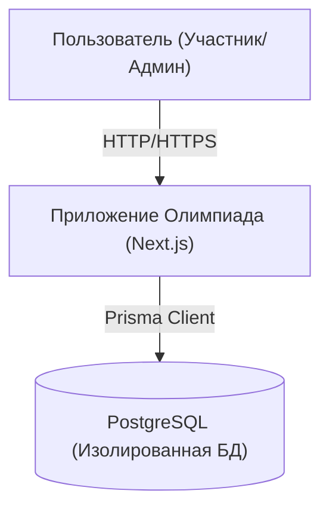
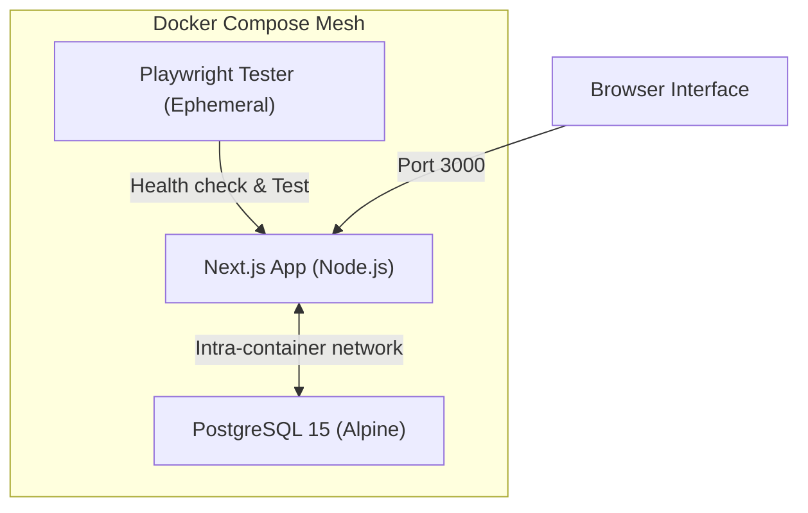

# Эволюционная Архитектура проекта "Олимпиада" (Diplom-public)

Данный документ описывает архитектурные решения, принятые для разработки веб-приложения организации и проведения олимпиад.

## 1. Обзор Системы

Система представляет собой современное Fullstack-приложение на базе Next.js, спроектированное для работы в изолированной среде Docker.

### System Context Diagram (C4)

### Container Diagram

## 2. Технологический Стек

Мы используем современный стек технологий, ориентированный на производительность, безопасность и удобство разработки (DX).

### Frontend & Backend (Fullstack)
- **Framework**: [Next.js 15+](https://nextjs.org/) (App Router) - обеспечивает SSR, SEO, API-роуты и оптимизацию.
- **Language**: [TypeScript](https://www.typescriptlang.org/) - строгая типизация для уменьшения количества ошибок.
- **Styling**: [Tailwind CSS](https://tailwindcss.com/) - утилитарный CSS-фреймворк для быстрой верстки.
- **UI Components**: [Shadcn UI](https://ui.shadcn.com/) (на базе Radix UI) - доступные, кастомизируемые компоненты.
- **Animations**: [Framer Motion](https://www.framer.com/motion/) - для плавных микровзаимодействий.

### База Данных и ORM
- **Database**: [PostgreSQL 15](https://www.postgresql.org/) - надежная реляционная БД.
- **ORM**: [Prisma](https://www.prisma.io/) - типобезопасный ORM для взаимодействия с БД, миграций и генерации типов.

### Аутентификация и Безопасность
- **Auth**: [Auth.js (NextAuth v5)](https://authjs.dev/) - современная система аутентификации.
- **Hashing**: bcrypt (нативный модуль) - высокая производительность при хешировании паролей.
- **Validation**: [Zod](https://zod.dev/) - схема-валидация данных.

## 3. Архитектурные Паттерны

### Server Actions (Zero-Crash Layer)
Бизнес-логика вынесена в app/actions. Каждый экшен обернут в try/catch для предотвращения обрушения сервера и возврата типизированных ошибок пользователю.

### Hybrid Grading Workflow
Система поддерживает как моментальную автоматическую проверку (тесты, текст), так и отложенную ручную проверку (код, эссе).
- **Auto-check**: Происходит сразу после вызова `finishOlympiad`.
- **Manual-check**: Администатор выставляет оценки через `Grading Actions`, что инициирует автоматический пересчет итогового рейтинга.

### Python Execution Environment (Sandbox)
Для задач по программированию используется **Pyodide** (WebAssembly), работающий в Web Worker. 
- **Изоляция**: Код выполняется полностью в браузере пользователя, не нагружая сервер.
- **Безопасность**: Лимиты времени выполнения (30с), троттлинг вывода и контроль памяти.
- **Интеграция**: Возможность подключения внешних библиотек (numpy, pandas и др.) через интерфейс администратора.

### Anti-Cheat Framework (Watchdog)
Комплексная система мониторинга поведения участника:
- **Client-side hooks**: Блокировка стандартных событий (copy, paste, contextmenu).
- **Focus tracking**: Детекция переключения вкладок через Page Visibility API.
- **Server-side logging**: Каждое подозрительное событие отправляется в `Violation Actions` и сохраняется в БД с привязкой к конкретной задаче или сессии.

### Middleware Security
Используется Next.js Middleware (middleware.ts) для проверки сессии и ролей пользователя (ADMIN / USER) до рендеринга страниц, что гарантирует защиту приватных роутов.

### Feature-Sliced Design (Адаптированный)
Функциональность сгруппирована логически:
- app/admin - Управление олимпиадами, пользователями и настройками.
- app/dashboard - Интерфейс участника.
- app/actions - Централизованная бизнес-логика.
- components/common - Глобальные UI элементы.

## 4. UI/UX Концепция
- **Минимализм**: Чистый интерфейс, акцент на контенте.
- **Темная тема**: Основная тема оформления (Glassmorphism).
- **Адаптивность**: Mobile-first подход.
- **Интерактивность**: Плавные переходы, анимации загрузки (Skeletons).

### Принцип "Без права на ошибку"
1. **Строгая типизация**: noImplicitAny в TypeScript.
2. **Валидация всего входящего**: Zod схемы для всех API эндпоинтов и форм.
3. **Автотесты**: Покрытие критического функционала E2E тестами.
