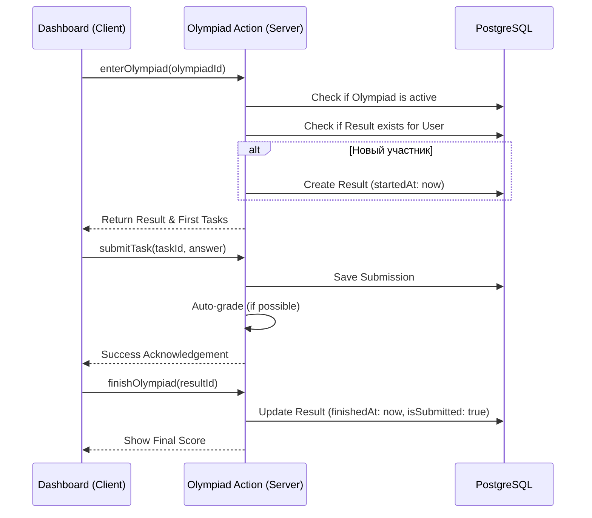
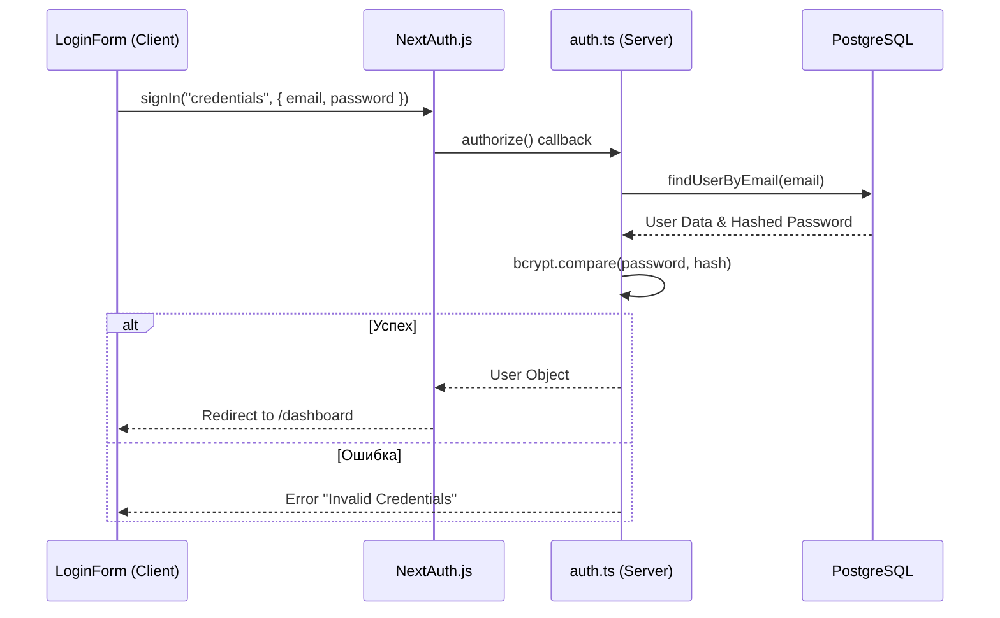
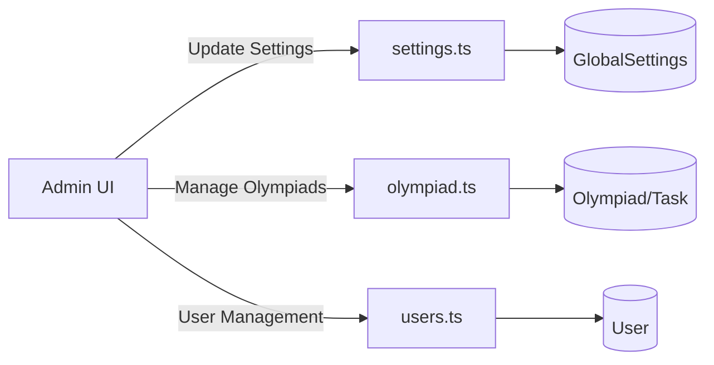
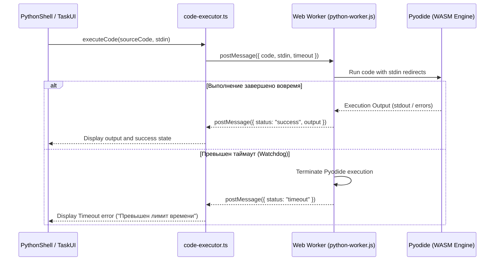
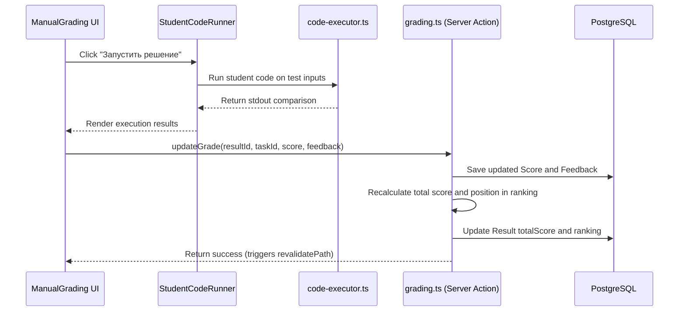

# Взаимодействие Компонентов и Сценарии

В данном документе описаны основные процессы взаимодействия между клиентом, сервером и базой данных на примере конкретных сценариев использования.

## 1. Сценарий: Участие в Олимпиаде

Процесс от входа в олимпиаду до завершения.

## 2. Сценарий: Аутентификация

Безопасный вход пользователя.

## 3. Сценарий: Управление Олимпиадой (Админ)

## 4. Сценарий: Изолированное Выполнение Кода (WebAssembly Sandbox)

Процесс безопасного выполнения Python-кода участника непосредственно в браузере.

## 5. Сценарий: Ручная проверка решений и Отладка Администратором

Сценарий детальной оценки решений студентов.

## 6. Схема Потока Данных (Data Flow)

1. **Input**: Пользователь взаимодействует с UI (React/Client Components).
2. **Trigger**: Вызывается Server Action с типизированными аргументами или локальная утилита выполнения (Pyodide).
3. **Validation**: Server Action проверяет сессию и данные через схему Zod.
4. **Backend**: Prisma выполняет транзакционные запросы к БД.
5. **Update**: Next.js автоматически вызывает `revalidatePath`, что мгновенно обновляет данные в интерфейсе для всех пользователей (без перезагрузки страницы).
