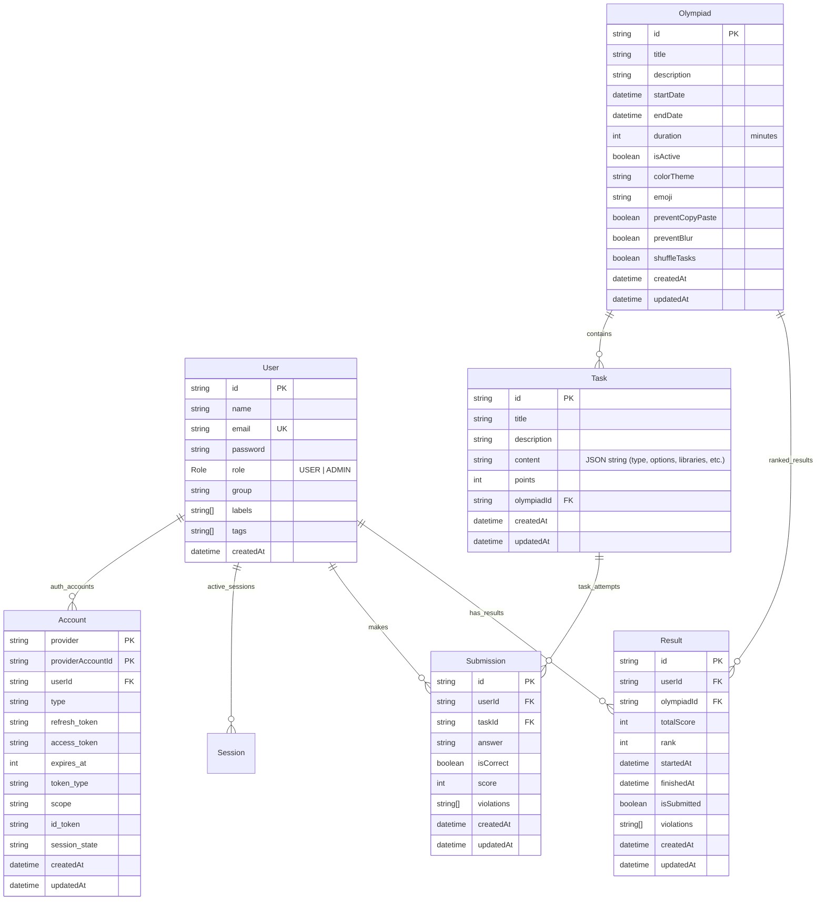

# Энциклопедия Базы Данных (Diplom-public)

В данном документе представлено исчерпывающее описание структуры базы данных проекта. Мы используем PostgreSQL 15 и Prisma ORM, что гарантирует строгую типизацию и целостность связей.

## Визуальная Схема (ER-Diagram)

---

## Детальная Структура Таблиц

### 1. Таблица User (Пользователи)
Центральная сущность системы. Хранит данные как участников, так и администраторов.

| Поле | Тип | Обязат. | Описание |
| :--- | :--- | :--- | :--- |
| `id` | `String` | Да | Уникальный идентификатор (CUID). |
| `name` | `String` | Нет | Отображаемое имя пользователя. |
| `email` | `String` | Да | Email (Unique Index). Используется для входа. |
| `password` | `String` | Нет | Хешированный пароль (bcrypt). |
| `role` | `Enum` | Да | Роль: `USER` или `ADMIN`. По умолчанию `USER`. |
| `group` | `String` | Нет | Класс или учебная группа участника. |
| `labels` | `String[]` | Да | Массив меток для административной фильтрации. |
| `tags` | `String[]` | Да | Массив тегов для группировки интересов/навыков. |
| `image` | `String` | Нет | Ссылка на аватар пользователя. |
| `emailVerified`| `DateTime` | Нет | Дата подтверждения email (NextAuth). |
| `createdAt` | `DateTime` | Да | Дата регистрации в системе. |
| `updatedAt` | `DateTime` | Да | Дата последнего обновления профиля. |

---

### 2. Таблица Olympiad (Олимпиады)
Описывает параметры конкретного мероприятия.

| Поле | Тип | Обязат. | Описание |
| :--- | :--- | :--- | :--- |
| `id` | `String` | Да | Идентификатор олимпиады (CUID). |
| `title` | `String` | Да | Заголовок олимпиады. |
| `description` | `String` | Да | Краткое описание/анонс. |
| `startDate` | `DateTime` | Да | Время официального открытия олимпиады. |
| `endDate` | `DateTime` | Да | Время закрытия доступа. |
| `duration` | `Int` | Нет | Время на выполнение в минутах после нажатия "Начать". |
| `isActive` | `Boolean` | Да | Видна ли олимпиада в списке доступных. |
| `colorTheme` | `String` | Нет | Настройка UI (цвет карточки/баннера). |
| `emoji` | `String` | Нет | Иконка-эмодзи для визуализации. |
| `preventCopyPaste` | `Boolean` | Да | Запрет копипаста на страницах олимпиады. |
| `preventBlur` | `Boolean` | Да | Детекция потери фокуса (уход со страницы). |
| `shuffleTasks` | `Boolean` | Да | Перемешивание порядка задач для участников. |
| `createdAt` | `DateTime` | Да | Дата создания. |
| `updatedAt` | `DateTime` | Да | Дата обновления. |

---

### 3. Таблица Task (Задачи)
Контентные единицы олимпиады.

| Поле | Тип | Обязат. | Описание |
| :--- | :--- | :--- | :--- |
| `id` | `String` | Да | ID задачи. |
| `title` | `String` | Да | Заголовок задания. |
| `description` | `String` | Да | Краткий контекст. |
| `content` | `String` | Да | Тело задачи (поддерживает Rich Text / Markdown). |
| `points` | `Int` | Да | Максимальное кол-во баллов за задачу. |
| `olympiadId` | `String` | Да | Связь (FK) с `Olympiad`. Удаляется при удалении олимпиады. |
| `createdAt` | `DateTime` | Да | Дата создания. |
| `updatedAt` | `DateTime` | Да | Дата обновления. |

---

### 4. Таблица Submission (Ответы)
Логирует каждое действие участника по решению задачи.

| Поле | Тип | Обязат. | Описание |
| :--- | :--- | :--- | :--- |
| `id` | `String` | Да | ID записи. |
| `userId` | `String` | Да | Кто отправил ответ (FK к `User`). |
| `taskId` | `String` | Да | На какую задачу ответ (FK к `Task`). |
| `answer` | `String` | Да | Строковый контент ответа участника. |
| `isCorrect` | `Boolean` | Нет | Статус проверки (авто/ручная). |
| `score` | `Int` | Нет | Начисленные баллы за этот конкретный ответ. |
| `violations` | `String[]` | Да | Логи нарушений, зафиксированных при ответе. |
| `createdAt` | `DateTime` | Да | Дата создания. |
| `updatedAt` | `DateTime` | Да | Дата обновления. |

---

### 5. Таблица Result (Результаты прохождения)
Агрегированная информация об участии пользователя в олимпиаде.

| Поле | Тип | Обязат. | Описание |
| :--- | :--- | :--- | :--- |
| `id` | `String` | Да | ID результата. |
| `userId` | `String` | Да | Ссылка на участника. |
| `olympiadId` | `String` | Да | Ссылка на олимпиаду. |
| `totalScore` | `Int` | Да | Итоговая сумма баллов (авторасчет). |
| `rank` | `Int` | Нет | Место в общем зачете. |
| `startedAt` | `DateTime` | Да | Когда пользователь нажал кнопку "Начать". |
| `finishedAt` | `DateTime` | Нет | Когда пользователь нажал кнопку "Завершить". |
| `isSubmitted` | `Boolean` | Да | Флаг окончательной сдачи работы. |
| `violations` | `String[]` | Да | Все зафиксированные нарушения за время участия. |
| `createdAt` | `DateTime` | Да | Дата создания. |
| `updatedAt` | `DateTime` | Да | Дата обновления. |

---

### 6. Таблица GlobalSettings (Системные настройки)
Таблица-синглтон (Singleton) для глобального управления приложением.

| Поле | Тип | Обязат. | Описание |
| :--- | :--- | :--- | :--- |
| `id` | `String` | Да | Всегда "singleton". |
| `registrationEnabled` | `Boolean`| Да | Глобальный рубильник регистрации новых юзеров. |
| `autoBackupEnabled` | `Boolean`| Да | Включение автоматических бэкапов. |
| `lastBackupAt` | `DateTime`| Нет | Время проведения последнего бэкапа. |
| `backupCount` | `Int` | Да | Количество хранимых копий (по умолчанию 10). |
| `updatedAt` | `DateTime` | Да | Дата последнего изменения настроек. |

---

### 7. Auth-инфраструктура (NextAuth)
- **Account**: Связывает пользователя с провайдерами авторизации (если планируется OAuth).
- **Session**: Управляет активными сессиями в браузере.
- **VerificationToken**: Токены для сброса пароля или подтверждения email.

---

## Безопасность и Целостность
1. **Cascade Deletes**: При удалении олимпиады автоматически удаляются все ее задачи, ответы участников и результаты.
2. **Индексация**: Поля `email` в `User` и комбинация `userId/olympiadId` в `Result` индексированы для быстрого поиска.
3. **Изоляция**: Схема спроектирована так, чтобы результаты одного пользователя не могли быть изменены другим на уровне ограничений БД (Foreign Key constraints).

---

## Физическое хранение
Все данные сохраняются в томе Docker: **db_data**. 
Даже при удалении контейнера БД, ваши данные останутся на диске сервера в `/var/lib/docker/volumes/Diplom-public_db_data`.
