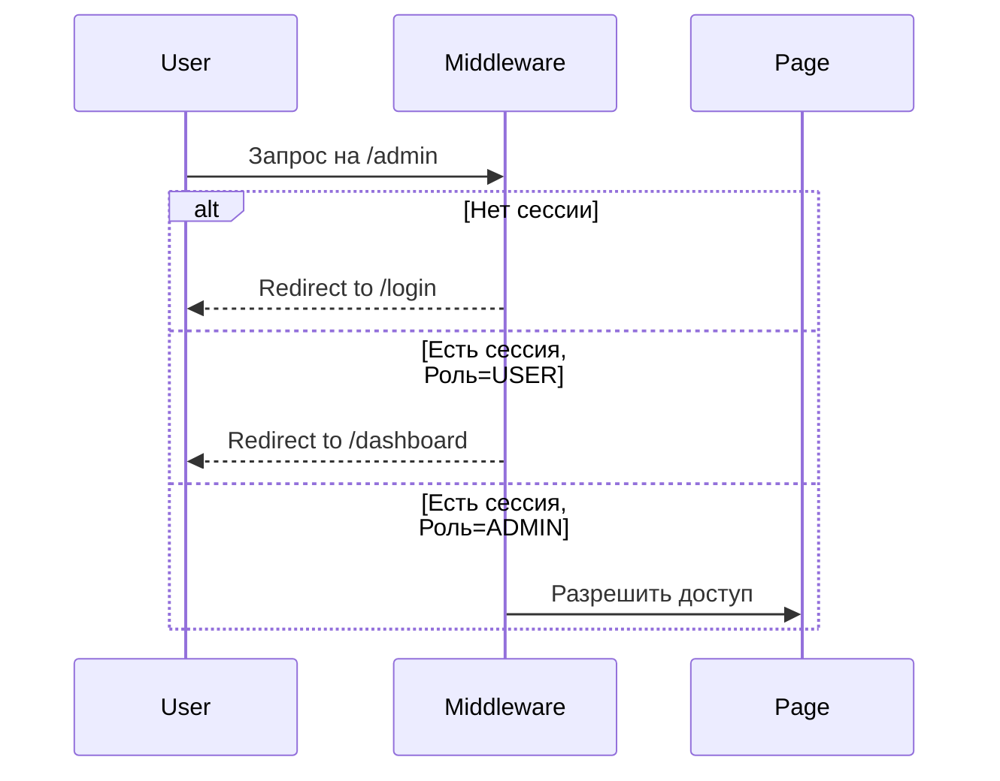

# Безопасность и Защита Данных

Безопасность является приоритетом в разработке Diplom-public. Система спроектирована с использованием многоуровневого подхода к защите.

## 1. Схема Аутентификации и Авторизации

### Middleware Protection
Все запросы проходят через Next.js Middleware (`middleware.ts`), который проверяет сессию пользователя до того, как запрос попадет на страницу или API-роут.

### Role-Based Access Control (RBAC)
Роли хранятся в БД (`ADMIN`, `USER`) и проверяются как на уровне Middleware, так и на уровне Server Actions.

## 2. Защита Инфраструктуры

### Изоляция БД
- PostgreSQL база данных работает в изолированной сети Docker (`olympiad_net`).
- Порты БД (5432) **не проброшены** на хост-машину, что делает невозможным прямой доступ из интернета или с сервера без прав суперпользователя.

### Docker-контейнеризация
Приложение запускается в контейнере с ограниченными правами, что минимизирует риски при потенциальной компрометации процесса.

## 3. Безопасность Данных

### Хеширование паролей
Используется нативный модуль `bcrypt`. 
- **Соль (Salt)**: Генерируется автоматически для каждого пароля.
- **Сложность**: Настроена для оптимального баланса между безопасностью и нагрузкой на CPU.

### Валидация ввода (Zod)
Все входящие данные (формы, параметры запросов) строго валидируются через схемы **Zod**. Это предотвращает:
- Инъекции (SQL-инъекции невозможны благодаря Prisma).
- Переполнение буфера.
- Некорректные форматы данных.

### Content-Security-Policy (CSP)
В `next.config.ts` настроены строгие заголовки:
- **connect-src/script-src**: Разрешен доступ к `cdn.jsdelivr.net` для загрузки Pyodide.
- **worker-src**: Разрешен запуск Web Workers (`blob:`, `self`).
- **X-Frame-Options**: Защита от кликджекинга (Clickjacking).

## 4. Защита при выполнении кода (Python Runner)

Система предотвращает злонамеренное или ошибочное использование ресурсов участниками:
1. **Timeout Control**: Жесткий лимит выполнения (30 секунд). По истечении времени процесс принудительно терминируется.
2. **Output Throttling**: Ограничение вывода в консоль (макс. 10 обновлений в секунду) для предотвращения зависания UI.
3. **Memory/Buffer Limit**: Ограничение истории вывода (до 1000 строк).
4. **Client-Side Only**: Код исполняется в Web Worker в браузере пользователя, что исключает риск атаки на сервер.

## 5. Целостность Данных и Анти-чит
Система минимизирует возможность нечестной игры:
1. **Submission Integrity**: Все ответы сохраняются с привязкой к `startedAt` и `finishedAt`. Попытки отправки после истечения времени блокируются на уровне сервера.
2. **Event Logging**: Каждое нарушение (`preventBlur`, `preventCopyPaste`) логируется в БД с временной меткой.
3. **Admin Verification**: Администратор имеет доступ ко всем логам нарушений для принятия решения о дисквалификации.

## 6. Обработка Ошибок (Zero-Crash Layer)

Все критические функции (Server Actions) обернуты в блоки `try/catch`. 
1. Ошибка логируется на сервере.
2. Пользователю возвращается понятное сообщение без раскрытия системных подробностей (предотвращение Information Leakage).
3. Приложение остается стабильным даже при сбоях в БД или сетевых ошибках.
